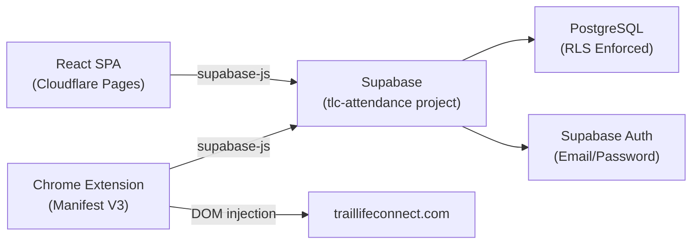

# Project Architecture Overview

## Project Purpose
TLC Attendance is a SaaS attendance tracker for Trail Life USA troops. MVP-1 is a single-troop deployment for SC-0110.

## Core Tech Stack

| Layer | Technology | Notes |
|:---|:---|:---|
| Frontend | React (Vite) SPA | Deployed to Cloudflare Pages |
| Database | Supabase PostgreSQL | Dedicated project (`tlc-attendance`) |
| Auth | Supabase Email/Password | JWT-based, `supabase-js` client |
| Hosting | Cloudflare Pages | `tlc.goodplusfast.com` |
| QR Scanning | `html5-qrcode` | Live continuous feed, no tap-to-capture |
| Chrome Extension | Manifest V3 | Syncs approved scans to `traillifeconnect.com` |

## System Diagram

## Architectural Rules
- RLS is enforced on every table from day one. No exceptions.
- All data access is scoped through `troop_users` via `auth.uid()`.
- COPPA compliance: only `first_name` + `last_initial` stored (no full names, no emails for youth).
- Schema supports multi-tenancy even though MVP-1 only exercises one troop.
- The dedicated Supabase project (`tlc-attendance`) is fully isolated from the `goodplusfast.com` project.

## Frontend Architecture (Phase 2)

### Project Structure (`frontend/`)
| Path | Purpose |
|:---|:---|
| `src/styles/global.css` | Global design tokens and CSS reset. Single source of truth for all visual styles. Ported from `jerome-portfolio` for consistency. |
| `src/hooks/useTheme.js` | Dark/light theme engine. Defaults to OS preference; persists choice in `localStorage` under key `tlc-theme`. |
| `src/lib/supabaseClient.js` | Singleton Supabase client. Security-hardened: generic error in production, detailed error in dev only. |
| `src/context/AuthContext.jsx` | Global auth state provider. Exposes `session`, `user`, `loading`, `signOut()`. |
| `src/components/ProtectedRoute.jsx` | Route guard. Blocks render during auth load; silently redirects unauthenticated users to `/login`. |
| `src/components/AppSpinner.jsx` | Full-screen branded loading state shown while session resolves. |
| `src/components/ThemeToggle.jsx` | Sun/moon icon button wired to `useTheme`. |
| `src/pages/Login.jsx` | Email/password login form. Clears errors on input; shows generic error to user; logs detailed error to console only. |

### Routing
- Uses `HashRouter` for Cloudflare Pages static SPA compatibility (`/#/login`, `/#/dashboard`, `/#/scanner`).
- All routes except `/login` are wrapped in `<ProtectedRoute>`.

### Auth Session Lifecycle
- On boot: `supabase.auth.getSession()` reads `localStorage` → prevents Login flash on PWA relaunch.
- `onAuthStateChange` subscription handles all subsequent auth events (login, logout, token refresh).
- `session = undefined` during boot; `null` = confirmed logged out; `Session` object = logged in.

### Design System
- CSS custom properties defined in `global.css` under `:root` (light) and `.dark` (dark).
- Theme class (`.dark`) toggled on `<html>` element by `useTheme` hook.
- All component styles reference tokens only — no hardcoded colors anywhere.

## Documentation Index
- [00_overview.md](./00_overview.md) - High-level overview and rules
- [01_database_schema.md](./01_database_schema.md) - Schema design and ERD
- [02_rls_and_auth.md](./02_rls_and_auth.md) - Roles and Row Level Security
- [03_qr_payload.md](./03_qr_payload.md) - QR parsing and lookup logic
- [04_scan_lifecycle.md](./04_scan_lifecycle.md) - Scan status flow and sync
- [../auth_flow.md](../auth_flow.md) - Supabase JWT lifecycle, AuthContext state, PWA behavior, Extension auth preview

## Deferred Features
- Multi-tenancy UX
- Stripe billing integration
- Demo mode
- Onboarding walkthrough
