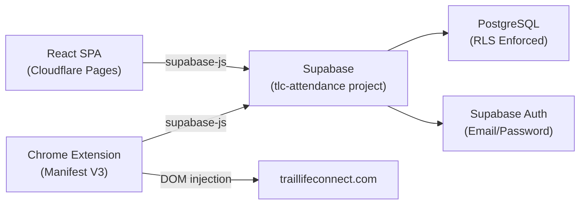

# Project Architecture Overview

## Project Purpose
TLC Attendance is a SaaS attendance tracker for Trail Life USA troops. MVP-1 is a single-troop deployment for SC-0110.

## Core Tech Stack

| Layer | Technology | Notes |
|:---|:---|:---|
| Frontend | React (Vite) SPA | Deployed to Cloudflare Pages |
| Database | Supabase PostgreSQL | Dedicated project (`tlc-attendance`) |
| Auth | Supabase Email/Password | JWT-based, `supabase-js` client |
| Hosting | Cloudflare Pages | `tlc.goodplusfast.com` |
| QR Scanning | `html5-qrcode` | Live continuous feed, no tap-to-capture |
| Chrome Extension | Manifest V3 | Syncs approved scans to `traillifeconnect.com` |

## System Diagram

## Architectural Rules
- RLS is enforced on every table from day one. No exceptions.
- All data access is scoped through `troop_users` via `auth.uid()`.
- COPPA compliance: only `first_name` + `last_initial` stored (no full names, no emails for youth).
- Schema supports multi-tenancy even though MVP-1 only exercises one troop.
- The dedicated Supabase project (`tlc-attendance`) is fully isolated from the `goodplusfast.com` project.

## Documentation Index
- [00_overview.md](./00_overview.md) - High-level overview and rules
- [01_database_schema.md](./01_database_schema.md) - Schema design and ERD
- [02_rls_and_auth.md](./02_rls_and_auth.md) - Roles and Row Level Security
- [03_qr_payload.md](./03_qr_payload.md) - QR parsing and lookup logic
- [04_scan_lifecycle.md](./04_scan_lifecycle.md) - Scan status flow and sync

## Deferred Features
- Multi-tenancy UX
- Stripe billing integration
- Demo mode
- Onboarding walkthrough
