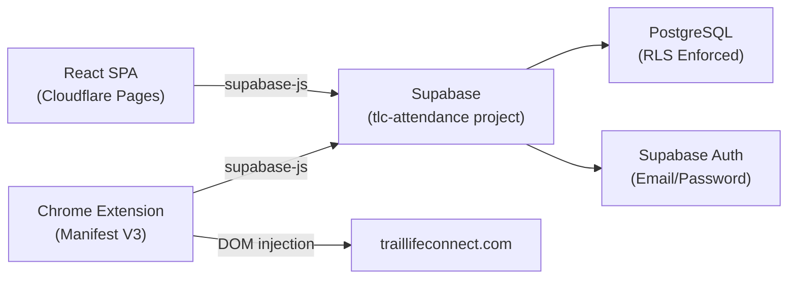

# Project Architecture Overview

## Project Purpose
TLC Attendance is a SaaS attendance tracker for Trail Life USA troops. MVP-1 is a single-troop deployment for SC-0110, but the schema and architecture are designed for future multi-tenancy.

## Core Tech Stack

| Layer | Technology | Notes |
|:---|:---|:---|
| Frontend | React (Vite) SPA | Deployed to Cloudflare Pages |
| Database | Supabase PostgreSQL | Dedicated project (`tlc-attendance`) |
| Auth | Supabase Auth (Email/Password + Google OAuth) | JWT-based, `supabase-js` client |
| Hosting | Cloudflare Pages | `tlc.goodplusfast.com` |
| QR Scanning | `html5-qrcode` | Live continuous feed, no tap-to-capture |
| Chrome Extension | Manifest V3 (Vite + @crxjs) | Syncs closed event attendance to `traillifeconnect.com` |
 
## System Diagram

## Architectural Rules
- RLS is enforced on every table from day one. No exceptions.
- All data access is scoped through `troop_users` via `auth.uid()`.
- COPPA compliance: only `first_name` + `last_initial` stored for youth. Adult leaders additionally store `email` in the roster.
- Schema supports multi-tenancy even though MVP-1 only exercises one troop.
- The dedicated Supabase project (`tlc-attendance`) is fully isolated from the `goodplusfast.com` project.
- `global_admins` is a system-level bypass table for platform owner access (not a troop-level role).
- **URL Routing for Tabs & Views**: Every distinct view state, tab, or screen must have its own unique URL (e.g., `/roster/members`, `/roster/leaders`, `/roster/:memberId/edit`) so browser history and back/forward buttons work as expected.

## Frontend Architecture

### Project Structure (`frontend/src/`)
| Path | Purpose |
|:---|:---|
| `styles/global.css` | Global design tokens and CSS reset. Single source of truth. Ported from `jerome-portfolio`. |
| `main.jsx` | App entry point. Renders `<App />` into `#root`. |
| `App.jsx` | Routing root: `HashRouter` + all routes. Wraps protected routes in `<ProtectedRoute><SidebarLayout>`. |
| `lib/supabaseClient.js` | Singleton Supabase client. Generic error in production, detailed in dev only. |
| `context/AuthContext.jsx` | Global auth state provider. Exposes `session`, `user`, `loading`, `signOut()`. |
| `context/TroopContext.jsx` | Troop context. Fetches all troops a user belongs to, exposes `troops[]`, `selectedTroopId`, `setSelectedTroopId`, `isGlobalAdmin`, `needsOnboarding`, `userDisplayName`, `refreshDisplayName()`. Persists selection in `localStorage` under `tlc_last_troop_id`. |
| `components/ProtectedRoute.jsx` | Route guard. Blocks render during auth load; redirects unauthenticated users to `/login`. Enforces hard onboarding gate — redirects users with incomplete profiles to `/profile`. |
| `components/SidebarLayout.jsx` | App shell. Renders full-width top layout header (app logo, title, troop switcher, theme toggle) with sidebar navigation and main content area beneath it. Renders `<Outlet/>` for page content. |
| `components/AppSpinner.jsx` | Full-screen branded loading state. |
| `components/ThemeToggle.jsx` | Sun/moon icon button wired to `useTheme`. |
| `components/RosterList.jsx` | Roster display, add, edit, delete, and CSV import. |
| `components/InviteUser.jsx` | Admin form to invite users by email to the troop. |
| `components/SessionSelector.jsx` | Dropdown for selecting or creating a session before scanning. |
| `hooks/useTheme.js` | Dark/light theme engine. Defaults to OS preference; persists in `localStorage` under `tlc-theme`. |
| `hooks/useScanLogic.js` | Core scan processing: 3-second cooldown, roster lookup by `tlc_id`/`member_id`, backfill, Supabase write. |
| `pages/Login.jsx` | Email/password login. Clears errors on input; shows generic error to user; logs detailed error to console only. |
| `pages/Profile.jsx` | Post-invite onboarding & ongoing user profile page. Handles display name (first name + last initial), password updates, member ID, and physical badge links. |
| `pages/Dashboard.jsx` | Troop overview: active user count, total sessions, unsynced session warnings. |
| `pages/Roster.jsx` | Full roster management page (wraps `RosterList`). |
| `pages/Scanner.jsx` | Live camera feed scanner for a specific event (`/events/:eventId`). Includes scan log, unknown member resolution modal, and event status actions (Close Event / Re-open). |
| `pages/Events.jsx` | Event history and management table. Clicking an event navigates to its dedicated Scanner page. |
| `pages/Billing.jsx` | Billing placeholder page (deferred). |

### Routing
Uses `HashRouter` for Cloudflare Pages static SPA compatibility (`/#/login`, `/#/dashboard`, etc.).

| Route | Page | Access | Notes |
|:---|:---|:---|:---|
| `/login` | `Login.jsx` | Public | Login screen |
| `/complete-profile` | — | Protected | Redirects to `/profile` |
| `/profile` | `Profile.jsx` | Protected (any user) | User profile, onboarding & security settings |
| `/dashboard` | `Dashboard.jsx` | Protected | Troop dashboard |
| `/roster` | — | Protected | Redirects to `/roster/members` |
| `/roster/members` | `Roster.jsx` | Protected | Roster view for youth members (default) |
| `/roster/leaders` | `Roster.jsx` | Protected | Roster view for adult leaders |
| `/roster/:memberId/edit` | `EditMember.jsx` | Protected | Edit member screen |
| `/events` | `Events.jsx` | Protected | Event history and management |
| `/events/:eventId` | `Scanner.jsx` | Protected | Scanner page for specific event |
| `/billing` | `Billing.jsx` | Protected (deferred) | Billing page |
| `/*` | — | — | Redirects to `/login` |

### Design System
- CSS custom properties defined in `global.css` under `:root` (light) and `.dark` (dark).
- Theme class (`.dark`) toggled on `<html>` element by `useTheme` hook.
- All component styles reference tokens only — no hardcoded colors anywhere.

## Documentation Index
- [00_overview.md](./00_overview.md) — High-level overview, rules, and frontend architecture
- [01_database_schema.md](./01_database_schema.md) — Schema design, ERD, and migration history
- [02_rls_and_auth.md](./02_rls_and_auth.md) — Roles, RLS policies, and UI/UX access rules
- [03_qr_payload.md](./03_qr_payload.md) — QR parsing, lookup logic, and Chrome Extension DOM integration
- [04_scan_lifecycle.md](./04_scan_lifecycle.md) — Scan status flow, event lifecycle, purge logic, and sync
- [05_frontend_patterns.md](./05_frontend_patterns.md) — Key frontend patterns: auth, troop context, scan logic
- [06_chrome_extension.md](./06_chrome_extension.md) — Chrome Extension architecture, auth, and sync mechanics
- [07_table_patterns.md](./07_table_patterns.md) — Responsive Grid Morph Table architecture and column width controls
- [08_icon_and_color_scheme.md](./08_icon_and_color_scheme.md) — Icon set and standard visual color coding for actions
- [09_popup_modals.md](./09_popup_modals.md) — Popup modal patterns, animations, and height handling
- [10_forms_and_inputs.md](./10_forms_and_inputs.md) — Forms, DateInput component, and m/d/yy date formatting
- [11_database_backups.md](./11_database_backups.md) — Database backup automation, retention, and restore SOP
- [13_roles_and_permissions.md](./13_roles_and_permissions.md) — Role definitions, permission matrix, and onboarding flows
- [../auth_flow.md](../auth_flow.md) — Supabase JWT lifecycle, AuthContext, PWA behavior
- [../hosting.md](../hosting.md) — Cloudflare Pages deployment and environment config

## Deferred Features
- Multi-tenancy UX (schema ready)
- Stripe billing integration
- Demo mode
- Role-based onboarding walkthrough
- Chrome Web Store submission
