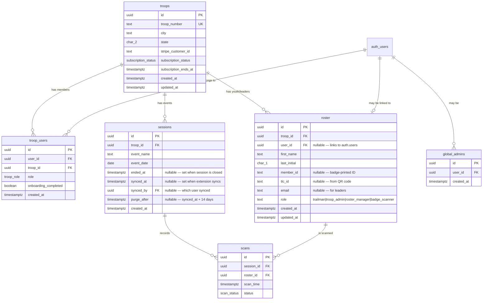

# Database Schema

> **Status**: Current as of Migration 009. See the [Migration History](#migration-history) section for a full changelog.

## Schema Diagram

## Tables

### 1. `troops`
Each troop is a tenant.
- `troop_number` (TEXT): Unique identifier (e.g., "SC-0110").
- `stripe_customer_id`, `subscription_status`, `subscription_ends_at`: Billing fields (nullable in MVP-1).
- `created_at`, `updated_at`: Managed by an `update_updated_at_column()` trigger.

### 2. `troop_users`
Junction table linking `auth.users` to `troops` with a specific role. **Central to all RLS policies.**
- `user_id`: References Supabase `auth.users`.
- `troop_id`: References `troops`.
- `role` (`troop_role` ENUM): The user's permission level in this troop.
- `onboarding_completed`: Flag set after a new user completes the `/complete-profile` flow.
- **Constraint**: `UNIQUE(user_id, troop_id)` — one role per user per troop.

### 3. `global_admins`
System-level bypass table. Users listed here bypass all troop-level RLS checks via the `user_has_role_in_troop()` helper function.
- Used for platform owner access (e.g., to debug any troop).
- **Not a troop-level role** — these users do not appear in `troop_users`.
- **Constraint**: `UNIQUE(user_id)`.

### 4. `roster`
Unified roster for both youth (Trailmen) and adult leaders.
- **Youth records**: `role = 'trailman'`. `user_id` and `email` are NULL.
- **Leader records**: `role` ∈ `{troop_admin, roster_manager, badge_scanner}`. `user_id` links to their Supabase auth account; `email` stores their email address.
- `first_name` (TEXT): Nickname if available, else First Name. Title-cased on import.
- `last_initial` (CHAR(1)): First character of Last Name. COPPA mitigation for youth.
- `member_id` (TEXT): Badge-printed ID in `YYYY-NNNNNN` format (from CSV). Nullable (leaders may not have one).
- `tlc_id` (TEXT): 12-char alphanumeric ID embedded in QR badge. Populated on first scan.
- `email` (TEXT): Nullable. Used for leaders to allow displaying their name on session history.
- **Constraints**: `UNIQUE(troop_id, member_id)`, `UNIQUE(troop_id, tlc_id)`, `UNIQUE(troop_id, user_id)` (partial, where `user_id IS NOT NULL`).

### 5. `sessions`
An attendance session = one event on one date for one troop.
- `event_name` (TEXT): e.g., "Regular Meeting".
- `event_date` (DATE).
- `ended_at` (TIMESTAMPTZ): Set by an admin when closing the session. **Once set, no further scans can be inserted** (enforced at DB level via RLS on the `scans` table).
- `synced_at` (TIMESTAMPTZ): Set by the Chrome Extension when it successfully completes syncing to `traillifeconnect.com`.
- `synced_by` (UUID): References `auth.users` — records which user ran the sync.
- `purge_after` (TIMESTAMPTZ): Automatically set to `synced_at + 14 days` by a database trigger. A nightly `pg_cron` job deletes all child `scans` rows after this timestamp.
- **Constraint**: `UNIQUE(troop_id, event_name, event_date)`.

### 6. `scans`
Individual attendance records (Sign In / Sign Out).
- `event_id` / `session_id` (UUID), `roster_id` (UUID).
- `sign_in_time` (TIMESTAMPTZ): Timestamp when member was signed in (replaces `scan_time`).
- `signed_in_by` (UUID): References `auth.users(id)` — leader who signed the member in.
- `sign_out_time` (TIMESTAMPTZ): Timestamp when member was signed out (nullable).
- `signed_out_by` (UUID): References `auth.users(id)` — leader who signed the member out (nullable).
- `status` (`scan_status` ENUM): Legacy/workflow field (`pending`, `approved`, `complete`). Sync gating is controlled at the event level via `events.ended_at`.
- **Constraint**: `UNIQUE(event_id, roster_id)` — one attendance record per member per event.

## Enum Types

| Enum | Values | Notes |
|:---|:---|:---|
| `subscription_status` | `active`, `past_due`, `canceled`, `unpaid` | Used on `troops` table |
| `troop_role` | `troop_admin`, `roster_manager`, `badge_scanner` | Used on `troop_users` table. **Note: renamed in migrations 003 and 017.** |
| `scan_status` | `pending`, `approved`, `complete` | Scan status (sync gating is controlled by event `ended_at`) |

> **Important naming note**: The roles in `troop_users` are `roster_manager` and `badge_scanner`. The `roster.role` column uses a separate TEXT check constraint with values `trailman`, `troop_admin`, `roster_manager`, `badge_scanner`. These are parallel systems.

## TLC ID vs Member ID (Dual-ID Strategy)
- `member_id`: Comes from the CSV import (printed on the physical badge, format `YYYY-NNNNNN`).
- `tlc_id`: Comes from the QR code payload (a 12-char alphanumeric string, used for DOM matching on `traillifeconnect.com`).
- On first scan, `tlc_id` is extracted from the QR code and written back (backfilled) to the roster row.
- Lookup priority: `tlc_id` first → `member_id` second.
- Without `tlc_id` stored, the Chrome Extension cannot perform DOM-based sync.

## Seed Data
- **SC-0110**: The real troop for MVP-1.
- **DEMO-001**: A test troop seeded with dummy roster entries to verify cross-troop RLS isolation. No real users are assigned to it.

## Migration History

| # | File | Description |
|:---|:---|:---|
| 001 | `001_initial_schema.sql` | Create all 5 tables, enums, triggers, seed SC-0110 and DEMO-001 |
| 002 | `002_rls_policies.sql` | Initial RLS policies with helper functions |
| 016 | `016_add_sign_out_fields.sql` | Add sign_in_time, signed_in_by, sign_out_time, signed_out_by columns to scans |
| 003a | `003_add_scanned_by.sql` | Add `scanned_by` to `scans` (experimental, may be superseded) |
| 003b | `003_roles_and_sync.sql` | **Rename roles** (`admin`→`troop_admin`, `member`→`badge_scanner`), add `global_admins` table, add `synced_at`/`synced_by` to `sessions`, add immediate purge trigger (later replaced) |
| 004 | `004_unified_roster_and_profiles.sql` | Add `role` and `user_id` columns to `roster` for unified youth+leader model; add self-update RLS |
| 005 | `005_roster_email.sql` | Add `email` column to `roster` |
| 006 | `006_update_rls_for_roles.sql` | Update all RLS policies to use renamed roles; grant `global_admins` full bypass via helper function |
| 007 | `007_add_session_ended_at.sql` | Add `ended_at` to `sessions`; restrict scan inserts to open sessions |
| 008 | `008_scan_purge_14_day_expiry.sql` | Replace immediate purge trigger with 14-day delayed expiry; add `purge_after` column; schedule `pg_cron` nightly job |
| 009 | `009_reset_purge_after_on_unsync.sql` | Update trigger so clearing `synced_at` also resets `purge_after` to NULL (enables un-sync) |
| 017 | `017_rename_roles.sql` | Rename roles (`troop_admin`→`roster_manager`, `billing_admin`→`troop_admin`) |
