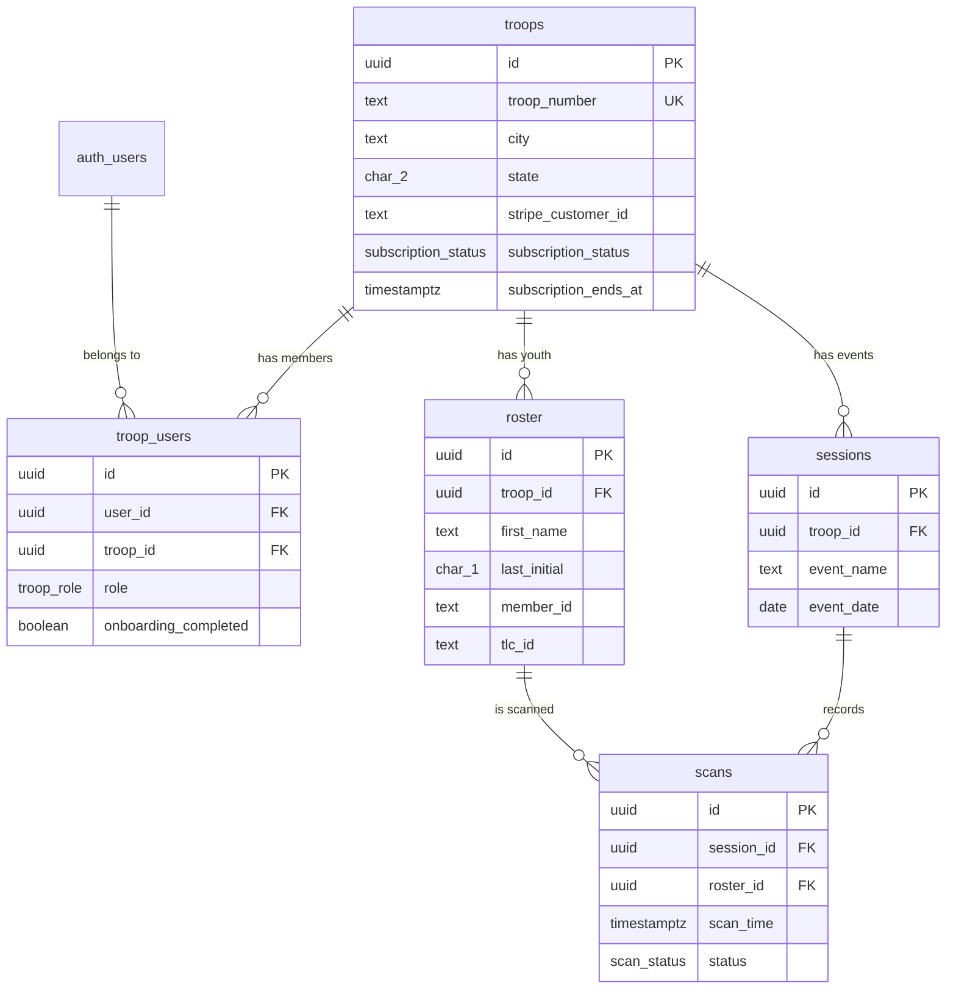

# Database Schema

## Schema Diagram

## Tables

### 1. `troops`
Each troop is a tenant.
- `id` (UUID): Primary key.
- `troop_number` (TEXT): Unique identifier (e.g., "SC-0110").
- `stripe_customer_id`, `subscription_status`, `subscription_ends_at`: Billing fields (nullable in MVP-1).

### 2. `troop_users`
Junction table linking `auth.users` to `troops` with a specific role. Central to all RLS policies.
- `user_id` (UUID): References Supabase `auth.users`.
- `troop_id` (UUID): References `troops`.
- `role` (`troop_role` ENUM): The user's permission level in this troop.
- **Constraints**: `UNIQUE(user_id, troop_id)` - a user can only have one role per troop.

### 3. `roster`
Troop members (youth). COPPA-safe: first name + last initial only.
- `first_name` (TEXT): Nickname if available, else First Name.
- `last_initial` (CHAR(1)): First character of Last Name.
- `member_id` (TEXT): Badge-printed ID in YYYY-NNNNNN format (from CSV).
- `tlc_id` (TEXT): 12-char alphanumeric ID embedded in QR badge. Populated on first scan.
- **Constraints**: `UNIQUE(troop_id, member_id)` and `UNIQUE(troop_id, tlc_id)`.

### 4. `sessions`
An attendance session = one event on one date for one troop.
- `event_name` (TEXT): e.g., "Regular Meeting".
- `event_date` (DATE).
- **Constraints**: `UNIQUE(troop_id, event_name, event_date)` prevents duplicate sessions.

### 5. `scans`
Individual attendance scans.
- `session_id` (UUID), `roster_id` (UUID).
- `status` (`scan_status` ENUM): pending → approved → complete.
- **Constraints**: `UNIQUE(session_id, roster_id)` prevents scanning the same member twice in one session.

## Enum Types
- `subscription_status`: `active`, `past_due`, `canceled`, `unpaid`
- `troop_role`: `billing_admin`, `admin`, `member`
- `scan_status`: `pending`, `approved`, `complete`

## TLC ID vs Member ID
The app uses a dual-ID strategy:
- `member_id` comes from the CSV import (printed on the physical badge).
- `tlc_id` comes from the QR code payload (used for DOM matching on `traillifeconnect.com`).
- On first scan, `tlc_id` is extracted and backfilled into the roster row.
- Lookup priority: `tlc_id` first, `member_id` second.

## Seed Data
- **SC-0110**: The real troop for MVP-1.
- **DEMO-001**: A test troop seeded with dummy roster entries to verify cross-troop RLS isolation.
