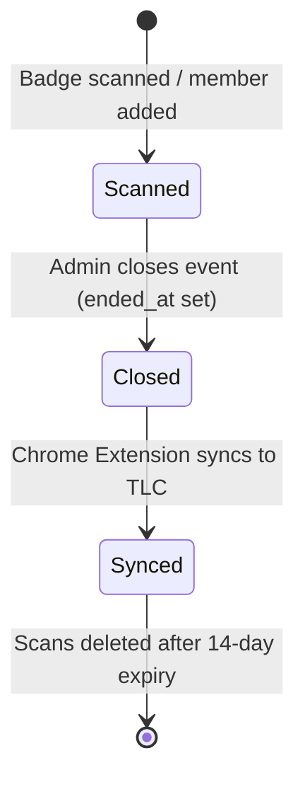
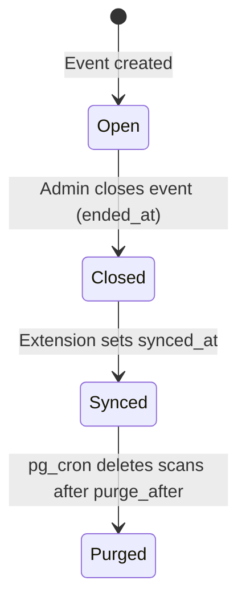

# Scan Lifecycle

## Status Overview

A scan progresses through its lifecycle as part of an event's attendance workflow:



| State / Trigger | Meaning | Who Performs It |
|:---|:---|:---|
| **Scanned** | Scan recorded / attendance logged | Scanner / Leader |
| **Closed (Approved)** | Event is closed; attendance is locked and ready to sync | `troop_admin` or `roster_manager` |
| **Synced** | Chrome Extension toggled checkboxes on `traillifeconnect.com` | `troop_admin` or `roster_manager` (via Extension) |

---

## Session / Event Lifecycle

A **session / event** represents one meeting or activity on one date for one troop.



| Event State | Condition | Effect |
|:---|:---|:---|
| **Open** | `ended_at IS NULL` | Scans can be inserted / logged |
| **Closed** | `ended_at IS NOT NULL` | Scans are locked; ready for TLC Extension sync |
| **Synced** | `synced_at IS NOT NULL` | `purge_after` automatically set to `synced_at + 14 days` |
| **Purged** | `purge_after <= now()` | Nightly `pg_cron` job deletes child `scans` rows |

---

## End-to-End Data Flow

1. **Import**: Admin imports the roster CSV. Roster rows are created with `member_id` (and `tlc_id` once populated).
2. **Create / Select Event**: A leader creates or selects an event on the Events page (`/events`), then opens its dedicated Scanner page. Any authenticated leader/scanner can do this.
3. **Scan**: Leader scans a badge or logs attendance.
4. **Record**: Attendance is inserted into `scans`. Database constraints prevent duplicate active records.
5. **Cooldown**: A 3-second frontend cooldown (`lastScanRef` in `useScanLogic.js`) prevents accidental double scans.
6. **Close Event (Approval)**: Admin marks the event as closed (`ended_at = now()`). This locks attendance from new scans and automatically approves all recorded attendance for sync.
7. **Extension Sync**: Admin opens the Chrome Extension on the Trail Life Connect attendance page, selects the closed event, and clicks "Sync". The extension:
   - Fetches all attendance records for the selected closed event from Supabase.
   - Locates each member's checkbox in the DOM on `traillifeconnect.com`.
   - Clicks each unchecked checkbox.
   - Sets `events.synced_at = now()` and `events.synced_by = auth.uid()`.
8. **Purge Countdown**: A database trigger automatically sets `events.purge_after = synced_at + 14 days`.
9. **Nightly Purge**: A `pg_cron` job runs at 03:00 UTC daily and deletes all `scans` rows for events where `purge_after <= now()`.

> **Un-Sync**: If `synced_at` is cleared on an event (e.g., admin reverts a sync), the trigger in migration 009 also resets `purge_after = NULL`, halting the purge countdown.

---

## Approval Model

> **Event-Level Approval**: Approval is not done scan-by-scan. Closing an event (`ended_at IS NOT NULL`) acts as the approval gate. Once an event is marked closed, all recorded scans for that event are eligible for synchronization.

### How Closing an Event Works

1. Admin clicks **"Close Event"** in the UI.
2. `events.ended_at` is set to `now()`. This locks the event from new scans (enforced by RLS).
3. The event immediately appears in the Chrome Extension's list of closed events ready to sync.

### Individual Scan Removal & Manual Status Toggle (Pre-Approval)

Before a session is ended, an authorized user (`isGlobalAdmin`, `troop_admin`, `billing_admin`, `admin`, `leader`) can manage the running attendance log on the Scanner page:
- **Individual / Bulk Scan Removal**: Selecting one or more scans and clicking "Remove" deletes them from the `scans` table permanently.
- **Manual Status Toggle**: Clicking a member's attendance status in the grid switches between Signed In and Signed Out. This triggers an explicit confirmation dialog (`Sign Member Back In` / `Sign Member Out`) displaying the member's full name before updating Supabase.
- **Status Labels & Offline Badging**:
  - `SIGNED IN`: Online scan, active sign-in (Green `#10b981`).
  - `SIGNED OUT`: Online scan, signed out (Blue `#3b82f6`).
  - `SIGNED IN - OFFLINE`: Scan saved offline, active sign-in (Yellow `#eab308`).
  - `SIGNED OUT - OFFLINE`: Scan saved offline, signed out (Yellow `#eab308`).
- **Real-time Event Counters**: The top `.scanner-header-card` computes real-time session metrics rendered as plain text:
  - `SCANNED IN`: Count of members currently active / signed in (`!raw_sign_out_time`).
  - `SCANNED OUT`: Count of members currently signed out (`!!raw_sign_out_time`).
  - `SCANNED TOTAL`: Total unique scans recorded (`[scanned in] + [scanned out]`).

This provides full operational flexibility for handling incorrect scans (e.g., a youth who left early or was signed out by mistake).

### Session Actions Summary (Admin / Leader)

| Action | When Available | Effect |
|:---|:---|:---|
| **End Session / Close Event** | Session is open (`ended_at IS NULL`) | Sets `ended_at`; bulk-approves all `pending` scans |
| **Reenable Session / Reopen Event** | Session ended, not yet synced | Clears `ended_at`; allows new scans again |
| **Reset Sync** | Session is synced (`synced_at IS NOT NULL`) | Clears `synced_at`, `synced_by`, `purge_after`; allows re-sync |
| **Delete Session / Delete Event** | Any state | Permanently deletes session and all child scans (cascades). Available in header status menu and as a dedicated red `DELETE EVENT` button below Scanner Actions. |

### Future Consideration

A dedicated per-scan approval UI (where an admin can individually review and approve/reject scans before ending the session) is not implemented in MVP-1. If added in a future version, it would show scans filtered by `status = 'pending'` and allow individual status updates.

---

## CSV Import Spec

**Source file**: `frontend/src/utils/csvParser.js` (uses `papaparse` library)

### Column Mapping

| CSV Column | Maps To | Rule |
|:---|:---|:---|
| `Last Name` | `last_initial` | Take first char after stripping stray quotes. `"Powell, III"` → `P` |
| `Nickname` | `first_name` | **Primary source**: use if non-empty AND not equal to `First Name` (case-insensitive) |
| `First Name` | `first_name` | Fallback if `Nickname` is blank or equals `First Name` |
| `Member Number` | `member_id` | Direct copy |
| *(all other columns)* | *(ignored)* | PII guardrail: addresses, emails, phone numbers are never read |

> **PII Guardrail**: The parser explicitly only reads `Last Name`, `First Name`, `Nickname`, and `Member Number`. All other CSV columns (address, phone, email, etc.) are silently ignored to prevent leaking PII into the database.

### Processing Rules

1. **Rows without `Member Number` are skipped** — these are likely non-youth rows or malformed entries.
2. **Nickname logic**: `if (rawNickname && rawNickname.toLowerCase() !== rawFirstName.toLowerCase())` — only uses nickname when it's genuinely different.
3. **Title-casing**: All `first_name` values are title-cased on import (e.g., `jaxson` → `Jaxson`).
4. **Last initial**: Strip stray quotes first, then take `charAt(0).toUpperCase()`.
5. **`tlc_id` is always `null` on import** — it is populated later on first badge scan.

### Upsert Strategy

The import uses `upsert` with `onConflict: 'troop_id, member_id'` and `ignoreDuplicates: true`. This means:
- Re-importing the same CSV is safe — existing members are not overwritten.
- New members in the CSV are added.
- If a `member_id` is not unique within the troop, the row is silently skipped.

```js
await supabase.from('roster').upsert(membersToInsert, {
  onConflict: 'troop_id, member_id',
  ignoreDuplicates: true
});
```

### Where It Lives in the UI

- **Page**: `/roster` → `RosterList` component
- **Access**: `troop_admin` and `billing_admin` only (gated by `canManageRoster` flag)
- **UX**: Simple `<input type="file" accept=".csv" />`. File is processed client-side entirely before the upsert — no file is sent to a server.

---

## Data Purge Design Decision

**Why purge scan data 14 days after sync?**

Once scans are synced to `traillifeconnect.com`, the raw scan records have served their purpose. Retaining them indefinitely creates unnecessary PII linkage (connecting a youth's name to specific meeting dates). The 14-day window gives admins time to catch sync errors and re-sync if needed before the data is removed. Scans for sessions that have never been synced are **not** purged automatically.

**Dashboard Warning Logic**: The Dashboard shows a warning for any unsynced session. The warning calculates days since the event and displays a countdown (frontend uses a 30-day soft warning; DB-level hard purge triggers only after sync + 14 days).
