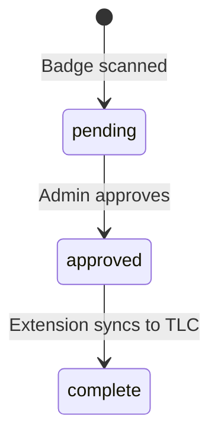

# Scan Lifecycle

## Status Lifecycle

## Status Definitions
- `pending`: Scan recorded by the scanner app, not yet reviewed by an admin.
- `approved`: Admin has confirmed the attendance record is valid on the dashboard.
- `complete`: The Chrome Extension has successfully toggled the checkbox on `traillifeconnect.com`.

## End-to-End Data Flow

1. **Import**: Admin imports the roster CSV. Roster rows are created with `member_id` (but no `tlc_id` yet).
2. **Setup Session**: Leader opens the Scanner page and selects or creates a session (event name + date).
3. **Scan**: Leader scans a badge. The QR is parsed, matched by `member_id`, and the `tlc_id` is backfilled.
4. **Record**: A `scans` row is inserted with `status = pending`.
5. **Cooldown**: A 3-second frontend cooldown prevents duplicate consecutive scans of the same badge. (Database-level `UNIQUE` constraint prevents duplicates over the entire session).
6. **Approval**: Admin reviews pending scans on the Dashboard and marks them as `approved`.
7. **Sync**: Admin opens the Chrome Extension on the Trail Life Connect attendance page and clicks "Sync". The extension fetches all `approved` scans for that event and toggles the corresponding DOM checkboxes. Scans are then marked `complete`.

## CSV Import Spec
Columns mapped from the Trail Life Connect CSV export:
- `Last Name` → `last_initial` (Take first char, handle quoted names like `"Powell, III"`).
- `Nickname` / `First Name` → `first_name` (Use Nickname if valid; fallback to First Name. Title-case everything).
- `Member Number` → `member_id` (Direct copy).

Edge cases handled: Blank lines, duplicate nickname/first name strings, missing nicknames.
