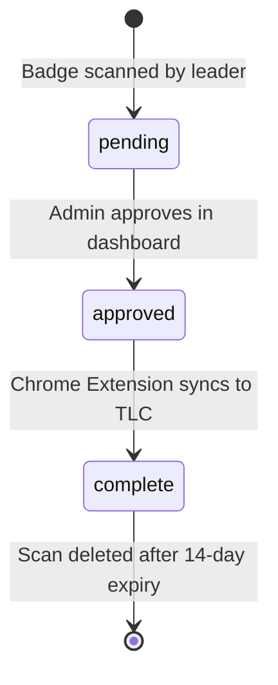
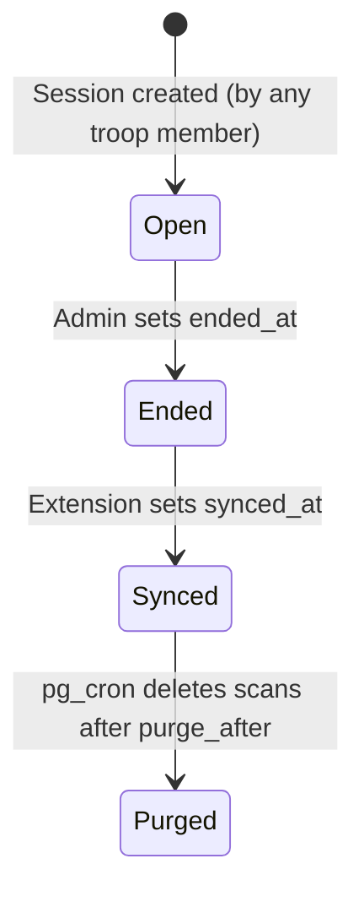

# Scan Lifecycle

## Status Overview

A scan progresses through three statuses, each representing a stage in the attendance workflow:



| Status | Meaning | Who Sets It |
|:---|:---|:---|
| `pending` | Scan recorded, not yet reviewed | Scanner (any troop member) |
| `approved` | Admin confirmed the record is valid | `troop_admin` or `billing_admin` |
| `complete` | Chrome Extension successfully toggled the checkbox on `traillifeconnect.com` | Chrome Extension (`troop_admin`/`billing_admin`) |

---

## Session Lifecycle

A **session** represents one event on one date for one troop. Sessions have their own lifecycle separate from individual scans:



| Session State | Condition | Effect |
|:---|:---|:---|
| **Open** | `ended_at IS NULL` | Scans can be inserted (RLS enforced) |
| **Ended** | `ended_at IS NOT NULL` | No new scans allowed (DB-level enforcement) |
| **Synced** | `synced_at IS NOT NULL` | `purge_after` automatically set to `synced_at + 14 days` |
| **Purged** | `purge_after <= now()` | Nightly `pg_cron` job deletes all child `scans` rows |

---

## End-to-End Data Flow

1. **Import**: Admin imports the roster CSV. Roster rows are created with `member_id` (no `tlc_id` yet).
2. **Create Session / Select Event**: A leader creates or selects an event on the Events page (`/events`), then clicks into the event to open its dedicated Scanner page (`/events/:eventId`). No role restriction — any authenticated troop member can do this.
3. **Scan**: Leader scans a badge. The QR is parsed, matched by `tlc_id` then `member_id`, and the `tlc_id` is backfilled if it was missing.
4. **Record**: A `scans` row is inserted with `status = pending`. Database `UNIQUE(session_id, roster_id)` prevents duplicates.
5. **Cooldown**: A 3-second frontend cooldown (`lastScanRef` in `useScanLogic.js`) prevents duplicate consecutive scans in the UI. The DB constraint is the authoritative safeguard.
6. **End Session**: Admin optionally marks the session as ended (`ended_at = now()`). After this, the RLS policy blocks new scan inserts even if someone tries via API.
7. **Approval**: Admin reviews `pending` scans on the Sessions page or Dashboard and marks them `approved`.
8. **Extension Sync**: Admin logs into the Chrome Extension on the Trail Life Connect attendance page, selects the event, and clicks "Sync". The extension:
   - Fetches all `approved` scans for the selected session from Supabase.
   - Locates each member's checkbox in the DOM using the selector `#${tlcId}-${eventId}-attended`.
   - Clicks each unchecked checkbox.
   - Sets each scan's `status` to `complete`.
   - Sets `sessions.synced_at = now()` and `sessions.synced_by = auth.uid()`.
9. **Purge Countdown**: A database trigger automatically sets `sessions.purge_after = synced_at + 14 days`.
10. **Nightly Purge**: A `pg_cron` job runs at 03:00 UTC daily and deletes all `scans` rows for sessions where `purge_after <= now()`.

> **Un-Sync**: If `synced_at` is cleared on a session (e.g., admin reverts a sync), the trigger in migration 009 also resets `purge_after = NULL`, halting the purge countdown.

---

---

## Approval Queue

> **Important architectural note**: There is currently no dedicated "Approval Queue" page or view. Scan approval is a session-level bulk action, not an individual scan-by-scan review UI. This is a deliberate MVP-1 simplification.

### How Approval Works

Approval is triggered by the **"End Session"** action, available to `troop_admin` and `billing_admin` users on both the **Scanner page** and the **Sessions page**.

When an admin clicks "End Session":
1. `sessions.ended_at` is set to `now()`. This closes the session to new scans (DB-level RLS enforcement).
2. All `scans` rows with `status = 'pending'` for that session are batch-updated to `status = 'approved'`.
3. The session is now ready for the Chrome Extension to sync.

```js
// The two-step approval pattern (from Sessions.jsx and Scanner.jsx)
await supabase.from('sessions').update({ ended_at: now }).eq('id', sessionId);
await supabase.from('scans').update({ status: 'approved' })
  .eq('session_id', sessionId).eq('status', 'pending');
```

### Individual Scan Removal (Pre-Approval)

Before a session is ended, an admin or scanner can **remove individual scans** from the attendance log in the Scanner page. The Scanner page shows the running attendance list with checkboxes. Selecting one or more scans and clicking "Remove" deletes them from the `scans` table permanently.

This is the mechanism for handling incorrect scans (e.g., a youth who left early and shouldn't be marked present).

### Session Actions Summary (Admin Only)

| Action | When Available | Effect |
|:---|:---|:---|
| **End Session** | Session is open (`ended_at IS NULL`) | Sets `ended_at`; bulk-approves all `pending` scans |
| **Reenable Session** | Session ended, not yet synced | Clears `ended_at`; allows new scans again |
| **Reset Sync** | Session is synced (`synced_at IS NOT NULL`) | Clears `synced_at`, `synced_by`, `purge_after`; allows re-sync |
| **Delete Session** | Any state | Permanently deletes session and all child scans (cascades) |

### Future Consideration

A dedicated per-scan approval UI (where an admin can individually review and approve/reject scans before ending the session) is not implemented in MVP-1. If added in a future version, it would show scans filtered by `status = 'pending'` and allow individual status updates.

---

## CSV Import Spec

**Source file**: `frontend/src/utils/csvParser.js` (uses `papaparse` library)

### Column Mapping

| CSV Column | Maps To | Rule |
|:---|:---|:---|
| `Last Name` | `last_initial` | Take first char after stripping stray quotes. `"Powell, III"` → `P` |
| `Nickname` | `first_name` | **Primary source**: use if non-empty AND not equal to `First Name` (case-insensitive) |
| `First Name` | `first_name` | Fallback if `Nickname` is blank or equals `First Name` |
| `Member Number` | `member_id` | Direct copy |
| *(all other columns)* | *(ignored)* | PII guardrail: addresses, emails, phone numbers are never read |

> **PII Guardrail**: The parser explicitly only reads `Last Name`, `First Name`, `Nickname`, and `Member Number`. All other CSV columns (address, phone, email, etc.) are silently ignored to prevent leaking PII into the database.

### Processing Rules

1. **Rows without `Member Number` are skipped** — these are likely non-youth rows or malformed entries.
2. **Nickname logic**: `if (rawNickname && rawNickname.toLowerCase() !== rawFirstName.toLowerCase())` — only uses nickname when it's genuinely different.
3. **Title-casing**: All `first_name` values are title-cased on import (e.g., `jaxson` → `Jaxson`).
4. **Last initial**: Strip stray quotes first, then take `charAt(0).toUpperCase()`.
5. **`tlc_id` is always `null` on import** — it is populated later on first badge scan.

### Upsert Strategy

The import uses `upsert` with `onConflict: 'troop_id, member_id'` and `ignoreDuplicates: true`. This means:
- Re-importing the same CSV is safe — existing members are not overwritten.
- New members in the CSV are added.
- If a `member_id` is not unique within the troop, the row is silently skipped.

```js
await supabase.from('roster').upsert(membersToInsert, {
  onConflict: 'troop_id, member_id',
  ignoreDuplicates: true
});
```

### Where It Lives in the UI

- **Page**: `/roster` → `RosterList` component
- **Access**: `troop_admin` and `billing_admin` only (gated by `canManageRoster` flag)
- **UX**: Simple `<input type="file" accept=".csv" />`. File is processed client-side entirely before the upsert — no file is sent to a server.

---

## Data Purge Design Decision

**Why purge scan data 14 days after sync?**

Once scans are synced to `traillifeconnect.com`, the raw scan records have served their purpose. Retaining them indefinitely creates unnecessary PII linkage (connecting a youth's name to specific meeting dates). The 14-day window gives admins time to catch sync errors and re-sync if needed before the data is removed. Scans for sessions that have never been synced are **not** purged automatically.

**Dashboard Warning Logic**: The Dashboard shows a warning for any unsynced session. The warning calculates days since the event and displays a countdown (frontend uses a 30-day soft warning; DB-level hard purge triggers only after sync + 14 days).
