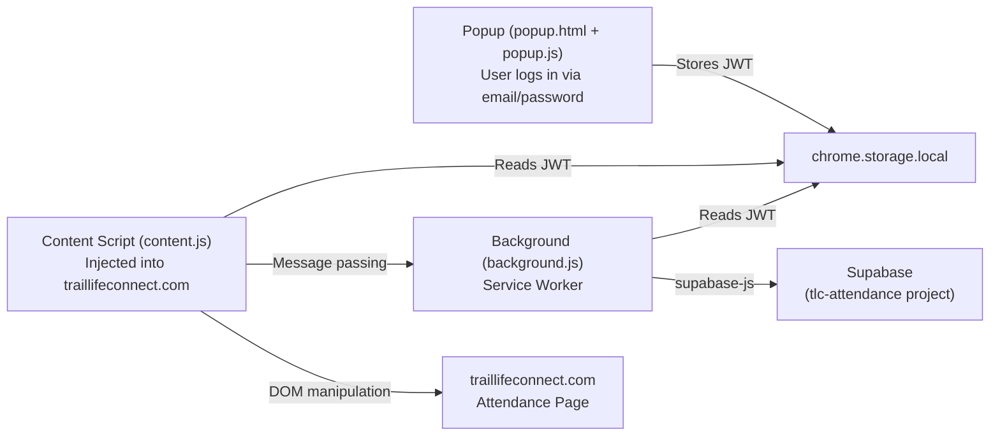

# Chrome Extension Architecture

## Overview

The Chrome Extension connects to the **same Supabase project** as the React SPA but is a completely separate build artifact. Its job is to bridge data from Supabase into the `traillifeconnect.com` DOM.

**Location in repo**: `extension/`

**Build tool**: Vite + `@crxjs/vite-plugin` (Manifest V3).

---

## Architecture Diagram

---

## Components

### `popup.html` + `popup.js` (Login UI)
- A simple email/password login form rendered in the extension popup.
- Calls `supabase.auth.signInWithPassword()`.
- On success, the Supabase SDK stores the session in `chrome.storage.local` (not `localStorage` — that is unavailable in extension contexts).
- On logout, clears the session from `chrome.storage.local`.
- Shows the logged-in user's email and a "Sign Out" button when authenticated.

### `background.js` (Service Worker)
- Instantiates the Supabase client configured to use `chrome.storage.local`.
- Because it uses the official Supabase SDK, it inherits **automatic token refresh** — the session stays alive without user intervention.
- Handles messages from `content.js` via `chrome.runtime.onMessage`:
  - `"GET_SESSION"`: Returns the current session from storage.
  - `"FETCH_APPROVED_SCANS"`: Queries Supabase for all `approved` scans for a given session ID.
  - `"MARK_COMPLETE"`: Updates scan status to `complete` and sets `sessions.synced_at` and `sessions.synced_by`.

### `content.js` (Injected into `traillifeconnect.com`)
- Injected by the manifest into pages matching `https://traillifeconnect.com/groups/*/attendance*`.
- Listens to `chrome.storage.onChanged` to detect when `supabase_session` becomes active or null — enables or disables the "Sync" button dynamically without requiring a page reload.
- Injects a "⚡ Sync TLC Attendance" button above the first attendance panel (`.panel.panel-theme`).
- On click, shows a modal listing available TLC events and letting the admin select which Supabase session to sync.
- Performs DOM-based checkbox toggling using the selector: `#${tlcId}-${eventId}-attended`.
- Reports results: counts of successfully toggled, already checked, and not-found members.

---

## Authentication in the Extension

| Concern | Solution |
|:---|:---|
| Storage | `chrome.storage.local` (not `localStorage`) |
| Token Refresh | Automatic via Supabase SDK in `background.js` service worker |
| Auth State in Content Script | `chrome.storage.onChanged` listener watches for session changes |
| Sync Button State | Disabled if `supabase_session` is null; enabled when session is active |
| Security | Anon key is bundled (safe — RLS enforces access); Service Role key is NEVER used |

---

## DOM Selector Contract

The extension relies on a specific DOM structure on `traillifeconnect.com`. This is **the most brittle part of the system**.

- **Checkbox selector**: `#${tlcId}-${eventId}-attended`
  - `tlcId`: The 12-character alphanumeric ID stored in `roster.tlc_id`.
  - `eventId`: The Trail Life Connect internal event ID, extracted from the current page URL or DOM.
- If Trail Life Connect changes their DOM structure, this selector breaks. There is no API — this is a best-effort DOM scrape.

**This is why `tlc_id` must be captured on first scan.** Without it, the extension cannot locate the correct checkbox.

---

## `manifest.json` Key Configuration
- **Manifest Version**: 3
- **Permissions**: `storage`, `activeTab`
- **Host Permissions**: `https://traillifeconnect.com/*`, `https://*.goodplusfast.com/*`
- **Content Scripts**: Injected at `document_idle` on `traillifeconnect.com/groups/*/attendance*`
- **Background**: `background.js` registered as a service worker.

---

## Known Limitations
1. **No Chrome Web Store distribution** (deferred). Currently installed as an unpacked extension via `chrome://extensions` or `edge://extensions`.
2. **DOM dependency**: Any structural change to `traillifeconnect.com` attendance pages can break the sync.
3. **Event ID extraction**: The `eventId` portion of the checkbox selector must be parsed from the current page. If the URL structure changes, this breaks.
4. **Desktop browser session**: The extension works in Chrome and Edge desktop browsers, requiring the user to be navigated to the correct TLC attendance page before clicking Sync.

---

## Packaging & Distribution Architecture

1. **Build Scripts**:
   - `build_extension.ps1`: PowerShell script located in the project root. Compiles the extension using Vite (`npm run build`) in `extension/` and packages `extension/dist` into `frontend/public/tlc_extension.zip`.
   - `build_extension.bat`: Batch wrapper allowing one-click execution of the PowerShell build script.
2. **Hosting & In-App Download**:
   - The `.zip` package is served as a static asset at `/tlc_extension.zip` when the frontend application is deployed (e.g. to Cloudflare Pages).
   - Dedicated `/extension` route (`frontend/src/pages/Extension.jsx`) provides installation guidelines, desktop compatibility notices, and direct download buttons.

